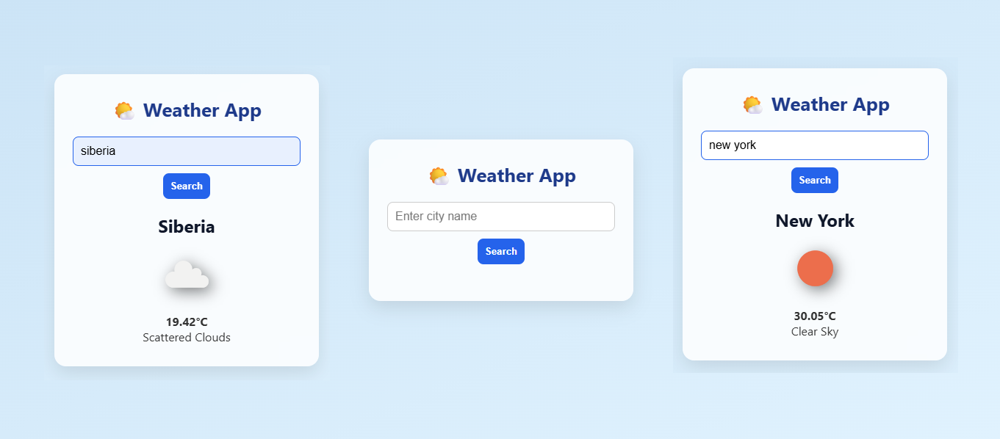

# 🌤️ Weather App

  
*A clean, responsive weather application using OpenWeather API*

## Features
- 🔍 Search weather by city name
- 🌡️ Temperature in Celsius
- 🌦️ Weather condition icons
- 📱 Mobile-friendly design
- 🛡️ Error handling for invalid inputs

### Local Setup
1. **Get an API Key** (free):
   - Sign up at [OpenWeatherMap](https://openweathermap.org/)
   - Get your API key from [API Keys](https://home.openweathermap.org/api_keys)

2. **Run the app**:
   ```bash
   git clone https://github.com/youknowankit/weather-app.git
   cd weather-app